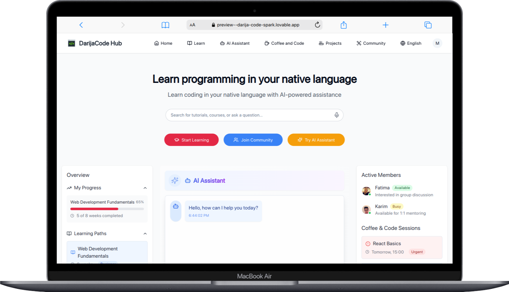
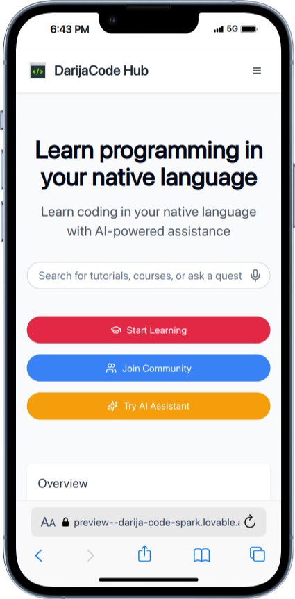
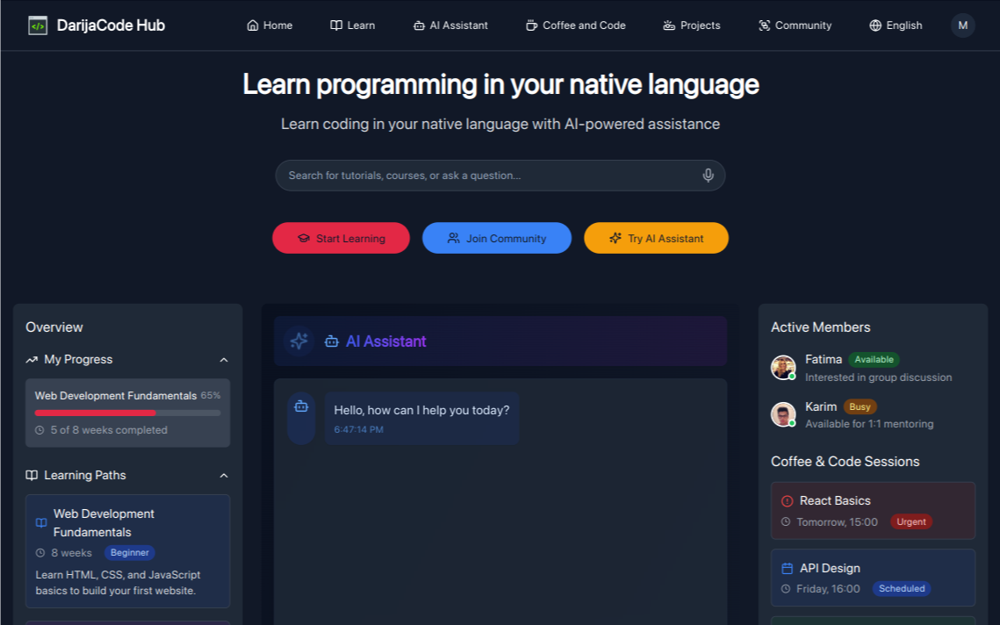
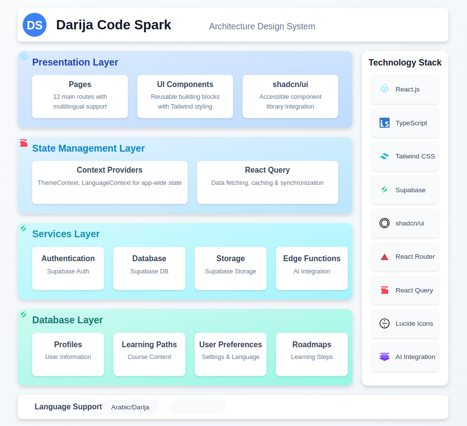

# Darija Code Spark

<p align="center">
  
</p>

🌟 **Learn to code, b darija!**

Darija Code Spark is a beginner-friendly platform designed to teach programming concepts in **Darija** (Moroccan Arabic).  
Our mission is to make coding more accessible to Moroccan learners by explaining technical concepts in a simple, familiar language.

## 🌐 Live Demo

👉 [Visit Darija Code Spark](https://darija-code-spark.lovable.app/)

## 📱 Responsive Design

<p align="center">
  
  
</p>

Fully responsive design with light and dark mode support for comfortable learning day and night.

## 📚 Key Features

- 🧠 **Interactive Learning Paths**: Personalized roadmaps based on your goals and experience level
- 🗣️ **Multi-language Support**: Learn in English, Arabic, French, or Moroccan Darija
- 🤖 **AI-Powered Assistant**: Get help and explanations in your preferred language
- 👨‍💻 **Project-Based Learning**: Apply your skills with practical coding projects
- 👥 **Community Features**: Join study groups and connect with other learners
- ☕ **Coffee & Code Sessions**: Scheduled virtual meetups for collaborative learning
- 🔍 **Personalized Experience**: Learning tailored to your preferences

## 🛠️ System Design

<p align="center">
  
</p>

### Tech Stack

- **Frontend**: React with TypeScript, Vite, Tailwind CSS
- **UI Components**: Shadcn UI components with Radix UI primitives
- **Backend & Auth**: Supabase (PostgreSQL, Auth, Storage)
- **AI Integration**: OpenAI/GROQ API for learning content generation
- **State Management**: React Query, Context API
- **Routing**: React Router
- **Styling**: Tailwind CSS with dark mode support via next-themes

### Core Components

- **Learning Paths**: Customizable learning journeys based on user **preferences**
- **Roadmap Generator**: AI-powered custom learning plan creation
- **Interactive Tutorial System**: Step-by-step learning with code examples
- **Multi-language Support**: Full i18n implementation for 4 languages
- **AI Assistant**: Contextual help in the user's preferred language

## 🔌 Third-Party Integrations

### APIs & Services
- **OpenAI/GROQ API**: Powers the AI assistant and content generation
- **Supabase**: Database, authentication, and storage services
- **i18next**: Internationalization framework for multi-language support

### Libraries & Frameworks
- **React**: UI library for building the user interface
- **TypeScript**: For type-safe code
- **Tailwind CSS**: Utility-first CSS framework
- **Shadcn UI**: Accessible and customizable component library
- **Radix UI**: Headless UI components
- **React Query**: Data fetching and state management
- **React Router**: Navigation and routing

### Developer Tools
- **Vite**: Fast development server and build tool
- **ESLint**: Code linting
- **Prettier**: Code formatting

## 🚀 Getting Started

### Prerequisites

- Node.js (v16+)
- npm or yarn
- Supabase account (for backend services)

### Installation

```bash
# Clone the repository
git clone https://github.com/MohaElbadry/darija-code-spark.git

# Navigate to the project directory
cd darija-code-spark

# Install dependencies
npm install

# Set up environment variables
# Create a .env file based on .env.example

# Start the development server
npm run dev
```

## 👥 Team

| Name              | Role                      | Socials |
|-------------------|---------------------------|---------|
| Mohammed El Badry | Cloud Computing Engineer  | [LinkedIn](https://www.linkedin.com/in/mohammed-elbadry/) / [GitHub](https://github.com/MohaElbadry) |
| Yasser Namez      | Cybersecurity Engineer    | [LinkedIn](https://www.linkedin.com/in/yasser-namez-0898a322b/) / [GitHub](https://github.com/yassernamez03) |
| Ibtissam Benabid  | Cybersecurity Engineer    | [LinkedIn](https://www.linkedin.com/in/ibtissam-benabid/) / [GitHub](https://github.com/BenabidIbtissam) |
| Iyas Grid         | Software Engineer         | [LinkedIn](https://www.linkedin.com/in/ilyas-grid/) / [GitHub](https://github.com/IlyasGrid) |

## 🎯 Vision

- Break the language barrier for Moroccan tech learners
- Inspire more people in Morocco to pursue careers in technology
- Build a supportive and inclusive tech community
- Make quality programming education accessible to Arabic speakers


---

<p align="center">Made with ❤️ in Morocco</p>
